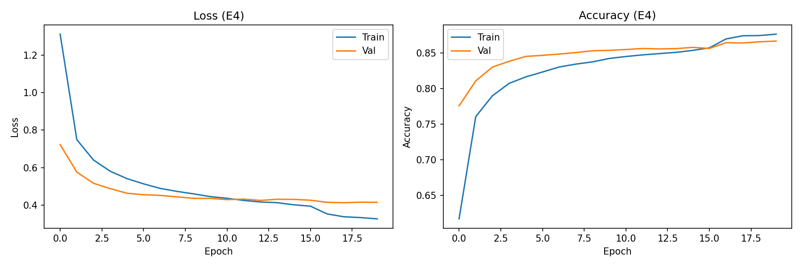

# Отчет по эксперименту: классификация EMNIST (MLP)

## 1. Вводные данные

Разработана и протестирована модель для многоклассовой классификации изображений набора данных EMNIST (сплит balanced, 47 классов). Изображения 28x28 векторизованы в одномерный тензор (784 признака). Аугментации не применялись.

## 2. Архитектура baseline-модели

* Тип: полносвязная нейронная сеть.
* Скрытые слои: 512 и 256 нейронов.
* Активация: ReLU.
* Функция потерь: CrossEntropyLoss.

## 3. Сводка экспериментов

Проведено сравнение методов регуляризации и подбор гиперпараметров. Базовый оптимизатор во всех тестах — Adam (lr=1e-3).

| ID | Конфигурация | Лучшая точность (Val) | Лучший Loss (Val) |
|---|---|---|---|
| E1 | Базовая модель | 0.8398 | 0.4583 |
| E2 | Dropout (p=0.3) | 0.8600 | 0.4210 |
| E3 | BatchNorm | 0.8436 | 0.4395 |
| E4 | Dropout + Scheduler + Clip | 0.8665 | 0.4127 |

## 4. Анализ результатов

Оценка архитектурных решений:
Базовая модель (E1) склонна к быстрому переобучению. Внедрение слоя Dropout (E2) показало большую эффективность для данной размерности сети по сравнению с пакетной нормализацией (E3), снизив ошибку на валидации.
Оптимальной конфигурацией стала модель E4. Комбинация Dropout, динамического шага обучения (ReduceLROnPlateau) и отсечения градиентов (clip_value=1.0) обеспечила наибольшую стабильность сходимости и итоговую точность 86.65%.

Оценка гиперпараметров (Learning Rate):
Дополнительно протестирована устойчивость к экстремальным значениям шага обучения. При lr=0.1 (O1) наблюдается расходимость градиентов и невозможность минимизации функции потерь. При lr=1e-5 (O2) зафиксировано недообучение из-за слишком малого шага обновления весов.

## 5. Аппаратная оптимизация

При профилировании пайплайна на GPU выявлено неполное использование вычислительных ресурсов (I/O bottleneck). В будущих итерациях требуется оптимизация конвейера передачи данных путем настройки параметров num_workers и pin_memory в классе DataLoader.
